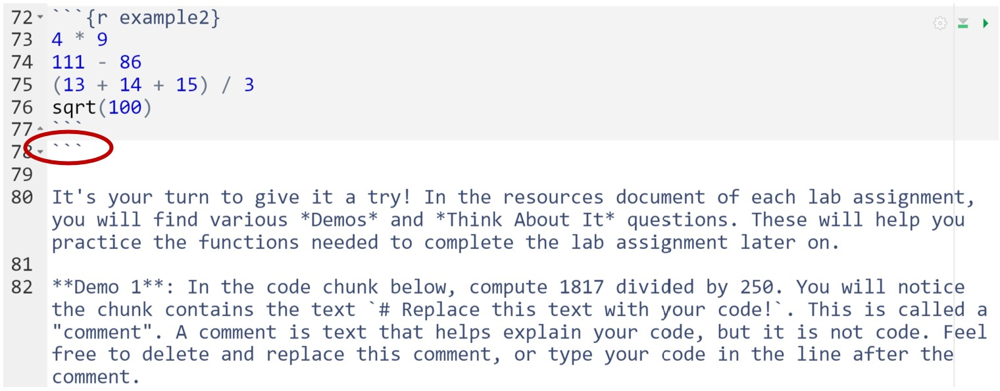
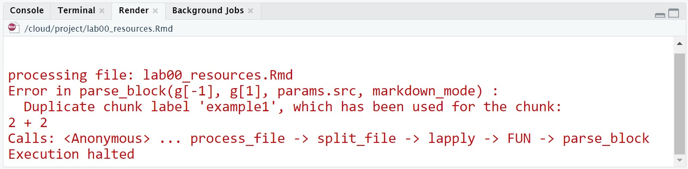

```{r setup, include=FALSE}
knitr::opts_chunk$set(echo = TRUE)
```


## Learning Objectives
1. Learn more about R, RStudio, and R Markdown
2. Learn about code chunks and how to use them 
3. Use R as a basic calculator
4. Read in and view a data set
5. Summarize quantitative and categorical data


***


## Lab Tutorial

### Getting Started: What is R?

There are several programming languages that can be used to analyze data. One of the most popular (and free!) *statistical* programming languages is called R. R is designed for handling data, generating plots, and performing statistical analyses - and it works by writing R code.

While the idea of coding may sound scary, please know that this is not a programming class. The lab component of this course will teach you how to edit and create basic R code in order to answer various statistical research questions. And the instructional team is always here to help!

We will be using a few different R components:

- **R** is a statistical programming language. You will be writing R code.
- **RStudio** is a friendly user interface that makes working with R code easier. (Formally, RStudio is an integrated development environment or IDE.) Instead of downloading R and RStudio to your personal device, we will be using Posit Cloud (formerly known as RStudio Cloud) to access course assignments via your web browser. 
- **R Markdown** is a specific file format (.Rmd) that helps produce nicely formatted documents that combine text and R code. This is an R Markdown file!

tl;dr - you will be editing and creating R code inside of R Markdown documents within the RStudio user interface. This may seem confusing at first and that is okay! It will make more sense as you get more experience with all three.


### Knitting

As noted above, R Markdown files help produce nicely formatted reports. But right now this file doesn't look too nice. To create a neat and clean report, we have to "Knit" the R Markdown file. To "Knit" this document, click the "Knit" button at the top of the file. Try it now!

A new window should appear with your knitted PDF file - and it should look a lot friendlier! If the new file does not appear automatically, click on the `lab01_resources.pdf` document in the bottom right Files window to open it. This knitted PDF file is what you will submit each week for lab. 

Helpful Tip: it is good practice to *knit often* while working through assignments. This can help you identify errors sooner rather than later. 


### Code Chunks

The above information has all been *text*. The text has some unique formatting (with asterisks and hashtags), but it is still just text. To run *code* in an R Markdown document, we need to create a *code chunk*. A code chunk looks like this:

```{r example1}
2 + 2
```

A code chunk...

- must start and end with three backticks (```)
- must have a *unique* name (the code chunk above is named "example1")

To run a code chunk, click the green play button in the upper right corner of the code chunk. The number "4" should appear as the output. (You may ignore the [1] that gets displayed with the answer, it is not important right now.) 

At its most basic function, R is a fancy calculator. You can perform calculations using standard operators. Let's see a few examples.

```{r example2}
4 * 9
111 - 86
(13 + 14 + 15) / 3
sqrt(100)
```

It's your turn to give it a try! In the resources document of each lab assignment, you will find various *Demos* and *Think About It* questions. These will help you practice the functions needed to complete the lab assignment later on.   

**Demo 1**: In the code chunk below, compute 1817 divided by 250. You will notice the chunk contains the text `# Replace this text with your code!`. This is called a "comment". A comment is text that helps explain your code, but it is not code. Feel free to delete and replace this comment, or type your code in the line after the comment. 

```{r demo1}
# Replace this text with your code!

```

*Think About It:* What is the name of the code chunk above?

Helpful Tip: feel free to add your own notes after a code chunk or Think About It question. Just be sure not to add text to a code chunk (this space should be used exclusively for writing R code).


### Common Errors

The two most common errors arise from copying and pasting. While we encourage students to copy, paste, and edit the provided examples, you must be very careful with what gets copied and pasted.  

As noted earlier, a code chunk starts and ends with **three** backticks (```). If you include too few or too many backticks, you will run into issues as shown below.

{width=600px}

In the picture above, three extra backticks were added after the code chunk. Below these additional backticks, we can see that the text turns light gray (instead of black). It is also possible that green play buttons for subsequent code chunks will disappear. 

To fix this issue, simply locate and delete the extra backticks. If a green play button ever disappears from a code chunk, scroll up through your R Markdown file until you find the extra backticks. You may need to refresh your webpage after making this fix.


The other common error is duplicating a chunk name (or reusing a chunk name). This arises from copying and pasting an entire code chunk, backticks and chunk name included. Each code chunk must have a *unique* name, otherwise the R Markdown file will fail to knit.  

Suppose we copied and pasted the entire `example1` code chunk below. If we then tried to knit the document, we would get the following error. 

{width=600px}

To fix this issue, simply change the name of the code chunk to something unique! Renaming it to `example3` (or any other chunk name that isn't used elsewhere in the document) will fix the problem.  

If you ever run into issues with your code, reach out to your GSI or post a screenshot of your error to Piazza. The instructional team is here to help!


### Storing Results

What happens if we want to save the answer to a calculation? We can store the result of some code by *assigning* it a name. Below, we will assign the result of 5 times 7 to the letter x.

```{r assignmentExample}
x <- 5 * 7
```

We read this code as "x gets the value of 5 * 7". The arrow is made using the less than symbol (<) and a hyphen (-). R will now remember that `x` is 35. In your Global Environment (the top right window), you should now see a "value" called `x`. 

You can access the value of `x` by typing `x` into R. Check it out:

```{r accessingExample}
x
```

We can also use the result to compute other calculations.

```{r accessingExample2}
(x + 5) / 10
```

**NOTE:** R is "case-sensitive", which means that uppercase letters are *different than* lowercase letters. Notice what happens when we ask R for the value of `X`:

```{r errorExample, error = TRUE}
X
```

When giving things names in R, you can only use a combination of letters, numbers, periods, and underscores. The names have to start with a letter or a period and cannot contain spaces or special characters. The simpler the name, the better.

In addition to storing simple numeric results, you can store other objects (such as text, matrices, and data sets) using this same assignment technique. 

**Demo 2**: In the code chunk below, store the result of 8 times 29 as a lowercase y. 

```{r demo2}
# Replace this text with your code!

```

Once you run this code chunk, you should see the stored result in your Global Environment (the top right window).


### Function Syntax

We will primarily work with R through the use of *functions*. R has a multitude of built-in functions to help us easily perform various tasks and statistical analyses. A function generally has the following form: 

```{r functionSyntax, eval = FALSE}
functionName(argument1, argument2, argument3, ...)
```

We have the name of the function followed by an open parenthesis, a sequence of *arguments*, and a close parenthesis. Each argument is separated with a comma. Some functions will require a single argument and some will require many.

Let's use the `read.csv()` function to read in a data set (and see an example of a function in action). 


### Reading in Data

The `read.csv()` function allows us to read a ".csv" file into our Global Environment. (Note: a .csv file is a comma-separated values file, one of the most common file types for storing data.) 

With the `read.csv()` function and the help of our assignment syntax (<-), we will store the provided data set as "penguins". 

```{r readcsvExample}
penguins <- read.csv(file = "penguins.csv", header = TRUE)
```

We used two arguments with the `read.csv()` function above. The first argument (file) was the name of the file. We can find the name of the file in the Files window (the lower right window). The second argument (header) informs R whether the .csv file has variable names in the top row of it (and in this case, it does). 

Although some functions have many arguments, it is generally only necessary to specify a few of them. Most arguments have built-in defaults that are suitable for our needs. We will always tell you when you need to specify an argument. 


### Viewing the Data

The `penguins` data set contains information on 333 penguins collected from three islands in the Palmer Archipelago in Antarctica. See the References section at the bottom of this document for more information. 

To view this data, click on the text "penguins" in the Global Environment (the top right window). Clicking on the stored data set name will open up a new window for you to view the data set. Additionally, we can click on the blue circle next to "penguins" in order to see a list of variable names. 

*Think About It:* How many variables does the penguins data set have?

*Think About It:* Is the variable `year` quantitative or categorical?

Instead of opening up the data set in a new window, we can also preview the data in the R Markdown document. The `head()` function displays the first few rows of a data set.  

```{r previewData}
head(penguins)
```

By default, this function outputs the first six rows. We can include an extra argument (`n`) to specify the number of rows we wish to preview. 

```{r previewData2}
head(penguins, n = 10)
```


### Summarizing Quantiative Data

Depending on the type of variable (categorical or quantitative), different summary measures are more appropriate than others. For a quantitative variable, we may wish to compute the mean, median, standard deviation, minimum, maximum, etc. Most of these functions are fairly straightforward in R! Let's compute some numerical summaries for the variable `body_mass_g`.

```{r meanExample}
mean(penguins$body_mass_g)
```

```{r medianExample}
median(penguins$body_mass_g)
```

```{r standardDeviationExample}
sd(penguins$body_mass_g)
```

```{r minAndMaxExample}
min(penguins$body_mass_g)
max(penguins$body_mass_g)
```

```{r quantileExample}
quantile(penguins$body_mass_g)
```

```{r summaryExample}
summary(penguins$body_mass_g)
```

The important thing to note from all of the functions above is the structure used to reference a specific variable. 

`dataset$variable`  

For most functions in R, we must include the data set when referencing the variable. Let's see what happens when we don't:

```{r variableError, error = T}
mean(body_mass_g)
```

In our Global Environment (the top right window), there is nothing stored as `body_mass_g`. This variable only exists *inside* of the `penguins` data set. So we must tell R to look for `body_mass_g` within `penguins` by using the format `penguins$body_mass_g`. 


**Demo #3**: Calculate the *median* for the variable `flipper_length_mm`. Three of the functions used above provide this summary value! 

```{r demo3, error = T}
# Replace this comment with your code

```


### Summarizing Categorical Data

Now that we've seen some functions for summarizing a quantitative variable, what about categorical data? Well, it doesn't make sense to take the mean or standard deviation of a categorical variable, so how can we summarize it? 

The most common way to summarize a categorical variable is to create a frequency table. This table counts the number of observations that fall into each category. The code, once again, is pretty straightforward!

```{r tableExample}
table(penguins$species)
```

The output shows us that most of the penguins in our data set are Adelie penguins! 

*Think About It:* What proportion of the penguins are Chinstrap penguins? How could we calculate this value?


### Summary

Try knitting this file one final time. If you run into any errors, please let us know!

You should now know a little bit more about R and its basic capabilities - using R as a calculator, storing results, reading data, viewing data, and summarizing data.

Over the course of the semester, we will learn to create plots, calculate various numerical summaries, and run an abundance of statistical analyses. When questions arise, please do not hesitate to reach out to our instructional team - we are here to help!

At this time, please click on the file titled `lab01_assignment.Rmd` (located in the bottom right window) to open up the lab assignment. The lab assignment is what you will complete and submit for credit! 


***


## References

Data were collected and made available by [Dr. Kristen Gorman](https://www.uaf.edu/cfos/people/faculty/detail/kristen-gorman.php) and the [Palmer Station, Antarctica LTER](https://pal.lternet.edu/), a member of the [Long Term Ecological Research Network](https://lternet.edu/), and the data were prepared by [Dr. Allison Horst](https://github.com/allisonhorst/palmerpenguins).
