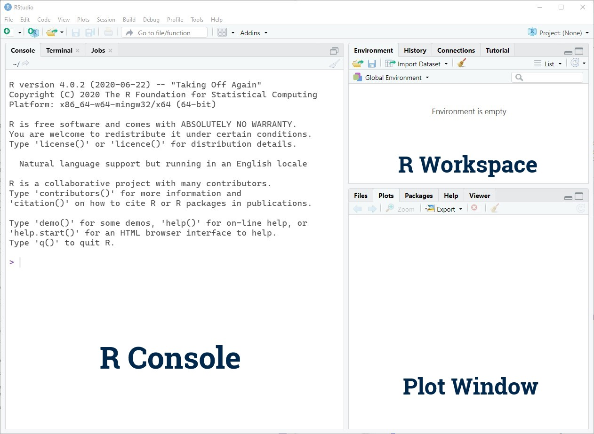
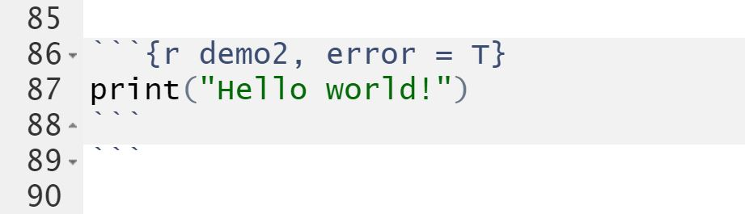
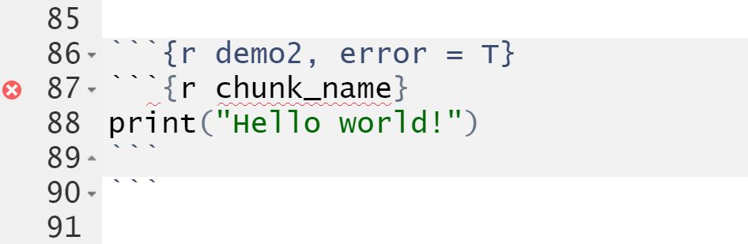
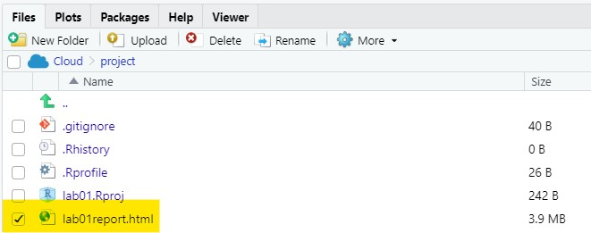
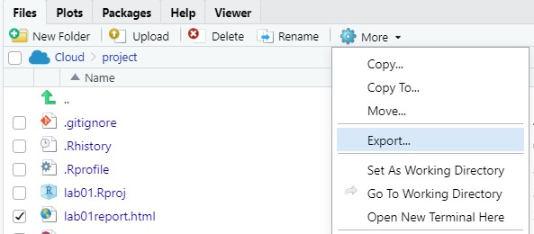
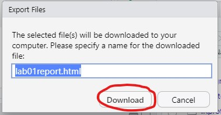
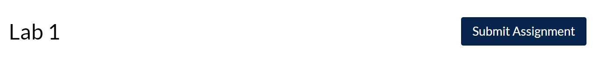
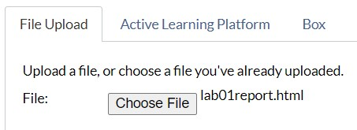

```{r setup, include=FALSE}
knitr::opts_chunk$set(echo = TRUE)
```

## Learning Objectives

### Statistical Learning Objectives

1. Types of variables
2. Structure of a data set

### R Learning Objectives

1. Learn the difference between R, R Studio, and R Markdown
2. Become familiar with the R Studio interface
3. Understand key components of an R Markdown document
4. Learn about code chunks and how to use them 
5. Become familiar with some basic R functions

### Functions covered in this lab

1. `print()`
2. `read.csv()`
3. `head()`
4. `str()`


## Lab Tutorial

### Getting Started: What is R?

In Statistics, we often use computers to analyze data. There are a lot of programs that help perform statistical analyses. One of the most popular (and powerful) is called R. R is a "statistical computing environment" that is designed for manipulating data, generating plots, and performing analyses. R works by writing R code.

That might sound scary, but *don't worry*: this is not a programming class. Over the course of the semester, you will learn how to edit some basic R code to help you analyze data and answer specific research questions. 



#### What are all these "R" terms?

There are a lot of "R" words floating around. What's going on?

- *R* is a "statistical computing environment" that's designed for manipulating data, generating plots, and performing analyses. It's also a programming language. You will be writing R code.
- *RStudio* is a pretty interface that makes working with R easier (formally, it is an Integrated Development Environment or IDE for R). If R is ice cream, then RStudio is the cone or cup. You will be writing R code within RStudio.
- *R Markdown* helps create reproducible analysis reports that combine text, R code, and R output (plots, analysis results, etc.) in one document. This document is an R Markdown report! You will be generating R Markdown documents by writing R code within RStudio.

This might seem confusing at first and that is okay! It will start to make sense as we get more experience with all three.


### R Markdown

This is an R Markdown document. R Markdown lets you combine text, R code, and R output in one pretty, reproducible report. If you're curious about this, you can find more details on using R Markdown at <http://rmarkdown.rstudio.com>.

The above information has all been text. (The text has some unique formatting, but it's still just text). To run *code* in an R Markdown document, we need to create a code *chunk*. A chunk looks like this:

```{r chunk_name}
print("Hello world!")
```

A chunk starts and ends with three backticks (```) -- this is **very** important. This is how R Markdown knows where your chunk starts and stops. If you include too few or too many backticks, you will run into problems (which we will show examples of later on). Note: a backtick can be found right below the Esc key on a US English keyboard.

In between these backticks is where you will write your code. This example code on line 68 will "print" the text provided to it. You can run this code chunk by clicking the green "play" button in the upper right corner of the chunk.

When you click the **Knit** button in R Studio, a document will be generated that includes both the content and the output of any embedded R code chunks within the document.

Also notice that this chunk has a name: "chunk_name". **Each chunk *must* have a unique chunk name**, otherwise your R Markdown file will fail to knit.

Typically, we will provide you with a code chunk and all you have to do is copy and paste example code from earlier in the document (you are also always welcome to type the code from scratch). When doing this, it is *very* important to only copy the **code** within the chunk and not the first or last line of the chunk (i.e. the backticks and chunk name). Doing so will create issues within your R Markdown document.

**Demo #1**: Use the `print()` function to print your first name. You are welcome to type the code from scratch or copy, paste, and edit the code from above. Note: if you choose to copy and paste the example code from above, be sure to *only* copy the code and not the first or last line of your chunk (i.e. the backticks and chunk name). Be sure that there are quotations around your name.

```{r demo1, error = T}
# Replace this text with the code!

```

You will notice the chunk contains the text `# Replace this text with the code!`. This is called a "comment". A comment is text that helps explain your code, but it is not code. Feel free to delete and replace this comment, or start a new line after it and paste the code there. See what happens!

Here are a couple examples of chunks that are improperly formatted.

In the example below, an extra set of backticks was copied over. When this occurs, your document will have issues determining where the end of the code chunk is and the green play button may disappear. Simply remove the extra backticks to correct the error.

{width=400px}

In the example below, the entire chunk was copied and pasted inside the provided chunk. With this error, you will not be able to knit the document. In this case, an error symbol appears in line 87 alerting you of the mistake.

{width=400px}


### Using R as a Calculator

At it's most basic, R is a fancy calculator.

Remember, you can run the code in this chunk by clicking the green "play" button in the upper right corner of the chunk.

```{r calculatorExample}
5 * 7
```

The result is 35.

**Demo #2**: In the `demo2` chunk below, compute 50 divided by 10.

```{r demo2, error = T}
# Replace this text with your code!

```


### Storing Results

What happens if we want to store the answers to these calculations? We can give the result of some code a name by **assigning** it to something. Below, we will assign the result of 5 times 7 to the letter x.

```{r assignmentDemo}
x <- 5 * 7
```

We read this code as "x gets 5 * 7". The arrow is made using the less-than symbol (`<`, shift + comma on a US English keyboard) and a hyphen. R will now remember that `x` is 35. You can see in your workspace (the top right window) that there is a "value" called `x` and it's 35. 

You can access the value of `x` by typing `x` into R. Check it out:

```{r x}
x
```

**NOTE:** R is "case-sensitive", which means that upper-case letters are *different than* lower-case letters. Notice what happens when we ask R for the value of `X`:

```{r X, error = T}
X
```

When giving things names in R, you can only use a combination of letters, numbers, periods, and underscores. The names have to start with a letter or a period and cannot contain spaces. The simpler the name, the better.

In addition to storing simple numeric results, you can store other objects (such as text and data sets) using this same assignment technique. 

**Demo #3**: In the `demo3` chunk below, store the result of 50 divided by 10 as a lowercase y. 

```{r demo3, error = T}
# Replace this text with your code!

```

Once you run this code chunk, you should see your stored result in the top right window.


### R Function Syntax

We will primarily work with R through the use of *functions*. A function generally looks something like this: 

```{r functionSyntax, eval = F}
functionName(argument1, argument2, ...)
```

Notice that we have the name of the function, followed immediately by an open parenthesis, a sequence of *arguments* , and a close parenthesis. Each argument is separated with a comma.

In Demo 1, we used the `print()` function and the only argument was the text we wanted the function to output. In the next section, we will use the `read.csv()` function to read in a data set. 


### Reading in Data

The `read.csv()` function helps us read in a ".csv" file into our workspace. Here, the only argument that we will use is the ".csv" file name of our data set (in quotations). With the help of our assignment syntax (`<-`) and the `read.csv()` function, we will store the data set as `penguins`. 

```{r readData}
penguins <- read.csv("penguins.csv")
```

This data set contains information on 333 penguins collected from three islands in the Palmer Archipeligo in Antarctica. 

Let's see what's in the data. We can peek at the first few rows of the data set using the `head()` function. Note: for the argument of this function, we don't need quotations because we are referring to a stored R object. 

```{r headPenguins}
head(penguins)
```

We read the line of code above as "*head* of *penguins*". Remember that `penguins` is what we named our data set. We can see that `penguins` contains a number of *variables*, detailed below:

- `species`: penguin species (Adelie, Chinstrap, and Gentoo)
- `island`: island on which the penguin was observed (Biscoe, Dream, or Torgersen)
- `bill_length_mm`: a number denoting bill length (in mm)
- `bill_depth_mm`: a number denoting bill depth (in mm) 
- `flipper_length_mm`: a number denoting flipper length (in mm)
- `body_mass_g`: a number denoting penguin body mass (in g)
- `sex`: penguin sex (female, male)
- `year`: study year (2007, 2008, 2009)

By default, the `head()` function outputs 6 rows of data. We can alter this number by adding in an additional argument. For this function, the additional argument is called `n`.

```{r headPenguins10}
head(penguins, n = 10)
```

Note that we separated the arguments by a comma. This is the basic structure of a function.

Another function that allows us to peek at the data is called `str()` (pronounced "stir", short for "structure"):

```{r strPenguins}
str(penguins)
```

This function provides slightly more detail for the data set (number of observations and number of variables and variables (name, data type, and a preview of the first handful of observations). 

That's all we are going to learn for today. Over the course of the semester, we will learn to create tables and plots, calculate numerical summaries, and run an abundance of statistical tests. When questions arise, please do not hesitate to reach out to our instructional team - we are here to help!


### Tips for R Markdown

1. **Knit and knit often**: Frequently knitting your document will help you make sure that all your code works and that the document looks the way you want. Try it out now! And don't forget to knit after you have completed the lab.
2. **Chunk names must be unique**: If you have two chunks with the same name, you will get the error "Duplicate chunk label" and your document will fail to knit. Simply find the duplicated chunk name and give it a new name.
3. **Be careful with copying and pasting**: We encourage you to copy, paste, and edit the code we have provided you, but be careful with what you copy and paste. Only include the code *within* the chunk and not the first and last lines of the chunk.


***


## Try It!

Complete the following exercises. The "Try It" questions will typically be code-based and will be graded for completeness - give *every* question your best shot! We strongly encourage you to form small groups and work together. 

> **1.** In the code chunk below, multiply 250 by your lab's section number. 

```{r tryIt1, error = T}
# Replace this text with your code!

```


> **2.** In the code chunk below, use the `head()` function to output only the first *three* rows of the `penguins` data set. 

```{r tryIt2, error = T}
# Replace this text with your code!

```


> **3.** Which of the variables in `penguins` are *quantitative* (or *numeric*)?

*Answer:* Replace this text with your answer.


> **4.** Which of the variables in `penguins` are *categorical*?

*Answer:* Replace this text with your answer.


***


## Dive Deeper

This section of the lab will have you "dive deeper" into the analysis. Typically, this section will involve two questions that are graded for *correctness*. (For Lab 1 only, these questions will be graded for *completeness*.) Be sure to ask for help, if needed! 

> **1.** What was the best part of lab for you today? What was challenging?

*Answer:* Replace this text with your answer (1-2 sentences).


> **2.** How do you think statistics will help you in your major or future career?

*Answer:* Replace this text with your answer (1-2 sentences).


***


## Submission Instructions

Carefully follow the instructions below to properly submit your completed work.

1. At the top of the document, change only the `author` field to your name (in quotes!). Do not change anything else at the top of the document.

2. When you have finished the lab, click the **Knit** button one last time.

{width=300px}

3.  In the Files pane (in the bottom right window), check the box next to `lab01report.html`: 

{width=300px} 

4. Click More > Export...

{width=300px} 

5. Click Download and save the file on your computer. **Do not change the file name.** Leave the name of the file as `lab01report.html`.

{width=300px}

6.  On the Stats 250 Canvas site, click the "Assignments" panel on the left side of the page. Scroll to find "Lab 1" and open the assignment. Click "Submit Assignment".

{width=300px}

7.  At the bottom of the page, upload your saved `lab01report.html` file. **You will only be able to upload a .html file -- do not upload any other file type.**

{width=300px}

8.  Click "Submit Assignment". You're done - give yourself a high five!


## References

Data were collected and made available by [Dr. Kristen Gorman](https://www.uaf.edu/cfos/people/faculty/detail/kristen-gorman.php) and the [Palmer Station, Antarctica LTER](https://pal.lternet.edu/), a member of the [Long Term Ecological Research Network](https://lternet.edu/), and the data were prepared by [Dr. Allison Horst](https://github.com/allisonhorst/palmerpenguins).


